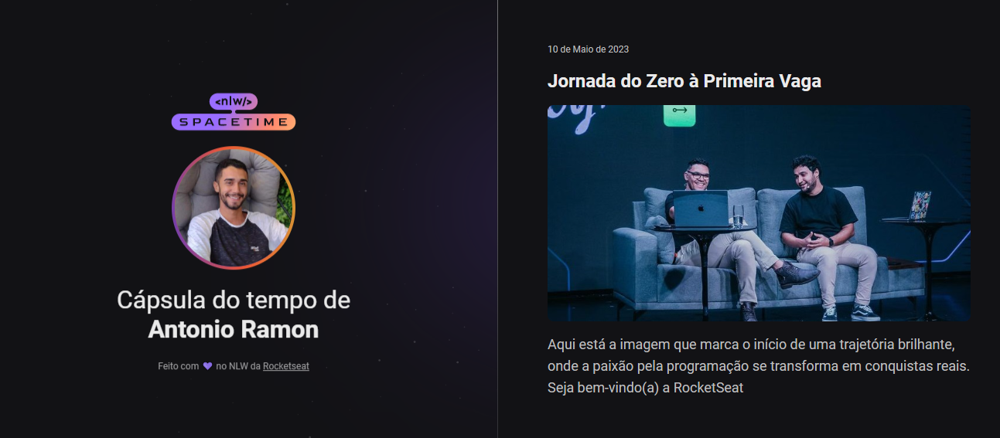

  

## 💻 Projeto

Esse é um projeto Web responsivo de uma cápsula do tempo para exibir memórias em uma linha do tempo.

## 🚀 Tecnologias

Esse projeto foi desenvolvido durante o NLW da Rocketseat usando as seguintes tecnologias:

- HTML
- CSS
- GIT e Github

## 🔖 Layout

Você pode visualizar o projeto ativo através desse [Link](https://nlw-spacetime-explorer.vercel.app/)
